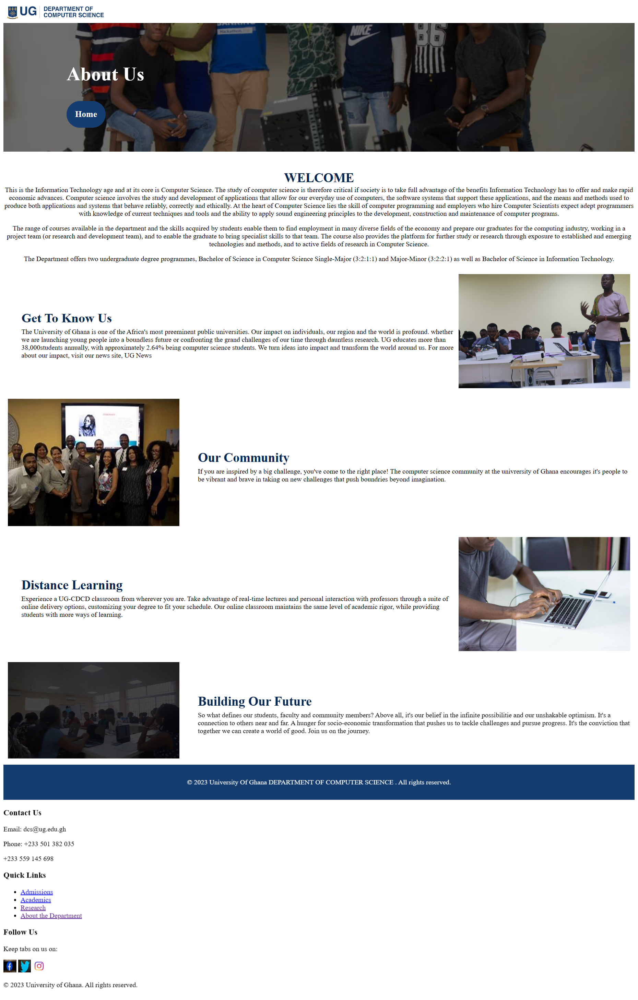
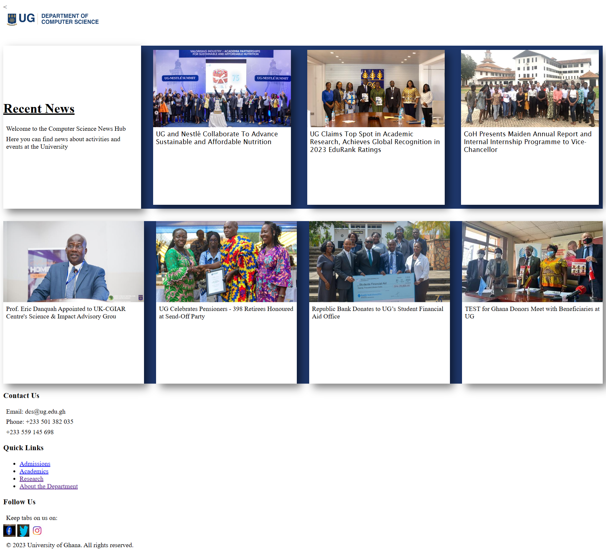
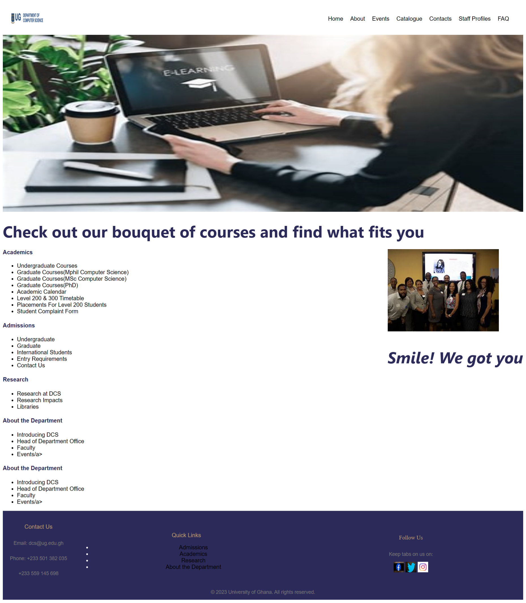
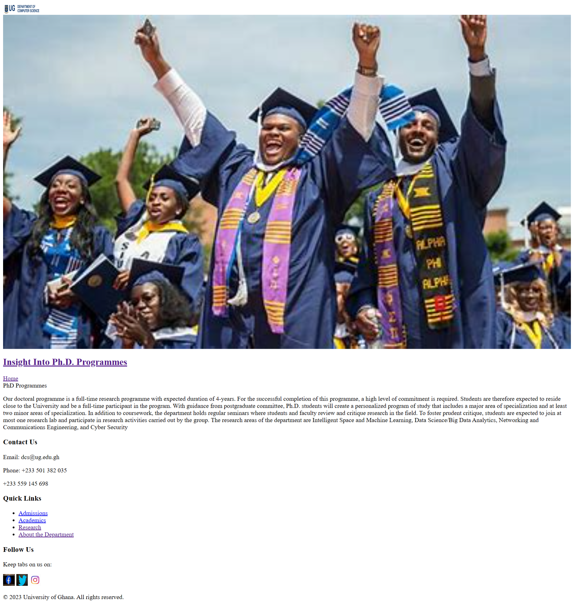
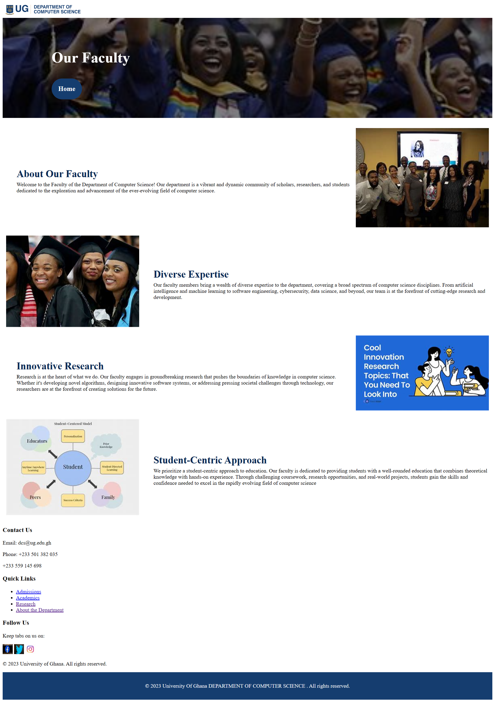
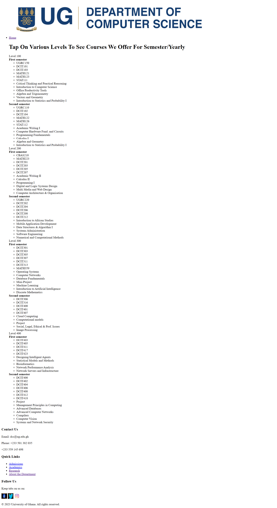
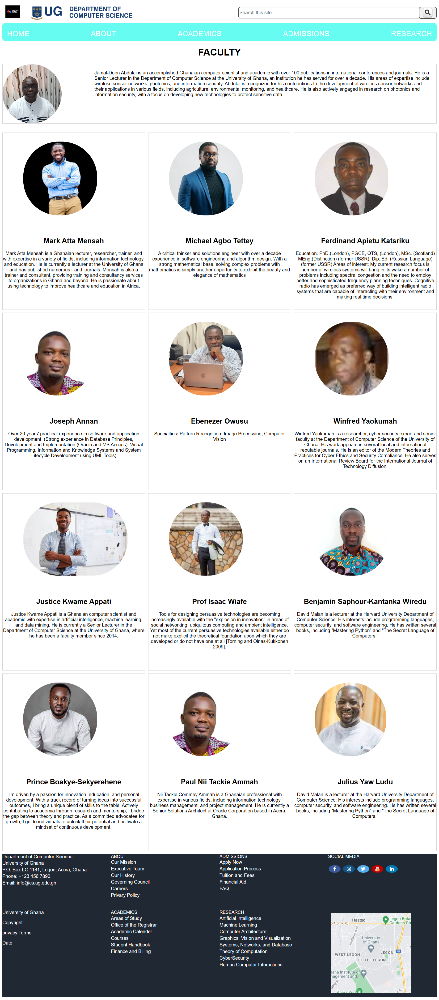
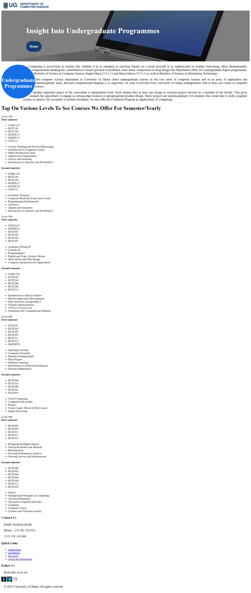
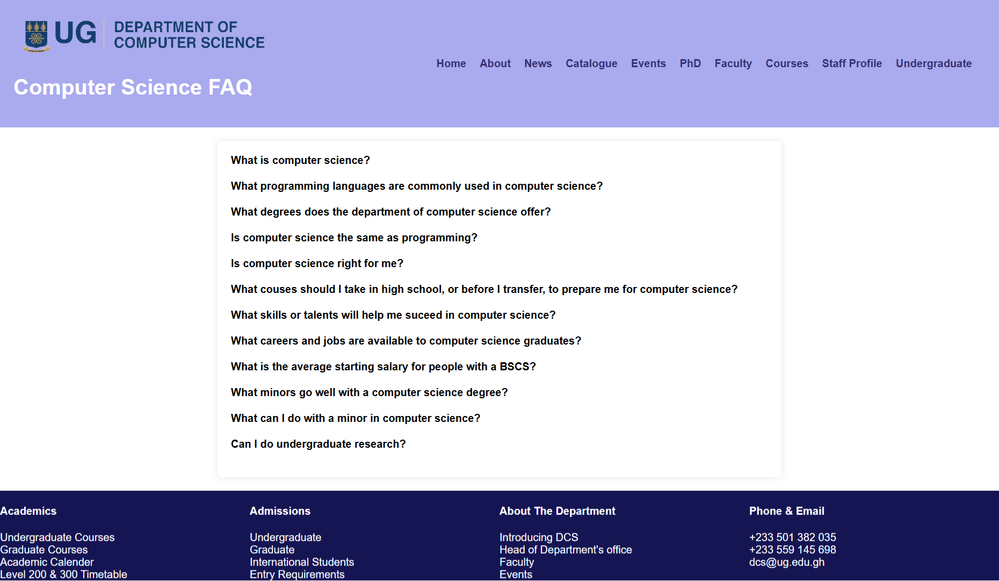

# 11342871_DCIT_205_IA
+ Introduction
+ Welcome to 11342871_DCIT205 IA  This website is designed to help studentts to know what the computer science department is about.

## Table of COntents

1.**Homepage**
2.**Events**
3.**Cataloge**
4.**Staff Profile**
5.**FAQ**
6.**News**
7.**Courses**
8.**Underagradute**
9.**Fculty**
10.**PhD**
11.**About**

# Screenshots

1.
[HOME](ss/Document.png)

# Lessons Learned
**Programming languages(HTML, CSS)
**Version Control(Git and GitHub for tracking changes and collaboration)
**Debugging and Troubleshooting(Identifying and fixing issues in your code)

# Acknoeledgement
**I would like to express my gratitude to God for the gift of life and strength to accomplish this project and also some friends who help me  to the development and success of this project.

